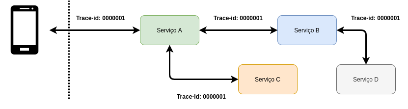

# OpenTracing

Nos últimos anos os modelos de arquitetura distribuídos, como o Micosserviços, vem sendo amplamente adotadas pelas empresas 
por prover vários benefícios para as mesmas, porém como tudo em tecnologia, temos vantagens e desvantagens!

Uma desvantagem bastante latente nesse estilo de arquitetura é o troubleshooting de problemas, quanto mais serviços, 
maior será a complexidade de encontrar a causa raiz do problema, como por exemplo na imagem abaixo:


Na imagem acima uma chamada HTTP, pode se tornar várias chamadas internas, aumentando os pontos de falhas! Quando ocorrer 
um erro, qual chamada interna falhou, como descobrir isso de forma efetiva?

Uma alternativa é coletar os logs de cada serviço e analisar, para poucos serviços parece viável e quando tiver inúmeras 
instâncias de um mesmo serviço, imagina que tenha 5 de cada serviço, ou seja, coletar logs de 20 serviços não é viável e 
o cenário fica pior, pois tem logs de outras chamadas, como saber a chamada da operação com erro?

Não parece ser viável e eficaz!

Visando esses problemas a comunidade começou desenvolver soluções para melhorar a observabilidade dos nossos serviços, 
como por exemplo:

- Trace
- Métricas
- Logs

Foi aonde surgiu a especificação do OpenTracing para tratar o pilar de Trace, no qual consiste em passar determinados 
metadados, que são gerados no início de cada operação, com o intuito de serem propagados internamente 
entre os serviços, podendo ser em qualquer protocolo que implementa a especificação, como por exemplo:

- HTTP
- AMQP
- RPC

Com base nos metadados gerados conseguimos rastrear as chamadas internas que fazem parte da operação em si, como por 
exemplo na imagem abaixo:



Na imagem acima, vemos que o `trace-id 000001` foi gerado no `Serviço A` e propagado em todas as chamadas internas que 
a operação precisou fazer para atender a requisição do cliente.

Demais né! 

Além de propagar os metadados os mesmos são enviados assíncronamente para uma determinada ferramenta que os armazena, 
provendo funcionalidades, como por exemplo:

- Catálogo de serviços
    - Filtros por serviços
- Catálogo de operações
    - Filtros por metadados
    - Filtros por data
    - Filtros por duração
- Gráfico da operação

E com essas funcionalidades conseguimos visualizar quais serviços a operação passou e onde ocorreu o erro, como por 
exemplo na imagem abaixo:


Na imagem acima, conseguimos filtrar a operação de acordo com algum metadado e conseguimos visualizar os serviços que a 
operação precisou passar e quais são os tempos, etc.

Demais né! Como o mercado e a comunidade conseguiram mitigar a complexidade de troubleshooting em sistemas distribuídos!

# Terminologia

Quando falamos sobre OpenTracing e sua especificação temos algumas terminologias e que são bastantes úteis para nós 
desenvolvedores.

## Span

Span é um período que representa uma operação, como por exemplo, uma requisição HTTP, na qual contém metadados extremamente 
importantes, como:

- Nome da operação
- Início da operação
- Término da operação
- Tags do span \ operação em si, como por exemplo: Nome do serviço, ip, método HTTP, etc.
- Baggages são pares de string de valor que se aplicam ao Span, no qual, se propagam em conjunto com o próprio rastreamento, como por exemplo: identificador do usuário.
- Logs do span \ operação em si.

## Trace

Um trace é um conjunto de `span` no qual contém a ordem de execução, como por exemplo:

```text
––|–––––––|–––––––|–––––––|–––––––|–––––––|–––––––|–––––––|–> time

 [Span A··················································]
    [Span B···············································]
      [Span C·············································]
        [Span D···········································]
```

## Dicas de Luram Archanjo

Utilize o `Baggage` para propagar informações de contexto do negócio, assim você consegue filtrar por eles e melhorar sua 
operação \ sustentação, como por exemplo, propague sempre o identificador do usuário, assim se o usuário X reclamar que 
está com erro, basta na ferramente de OpenTracing procurar por todas as operações com erro e com o identificador do 
usuário X.

## Informações de suporte

Gostaria de saber mais sobre a especificação? [Aqui tem uma explicação do que entendemos que você deve considerar!](https://opentracing.io/specification/)

Gostaria de saber mais sobre Tags? [Aqui tem uma explicação do que entendemos que você deve considerar!](../informacao_suporte/jaeger-concept-tags.md)

Gostaria de saber mais sobre Baggage? [Aqui tem uma explicação do que entendemos que você deve considerar!](../informacao_suporte/jaeger-concept-baggage.md)

Gostaria de saber mais sobre Logs? [Aqui tem uma explicação do que entendemos que você deve considerar!](../informacao_suporte/jaeger-concept-logs.md)