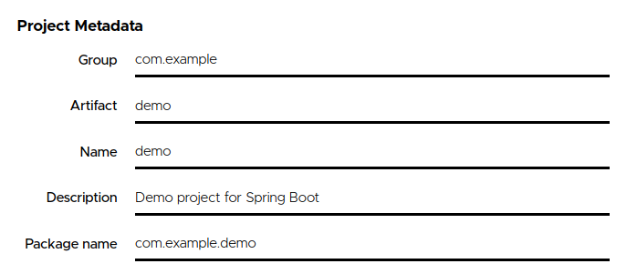
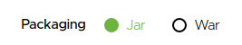

# Gerando projeto com Spring Initializr

Olá, nesse tutorial vamos aprender como gerar um projeto utilizando o [Spring Initializr](https://start.spring.io/), 
mas afinal o que é Spring Initializr?

## Spring Initializr

[Spring Initializr](https://start.spring.io/) é um site criado e mantido pela comunidade do [Spring](https://spring.io/) 
com o objetivo de fornecer uma ferramenta para auxiliar na criação de projetos que utilizam Spring e seus módulos, 
otimizando o tempo de setup do seu futuro projeto.

## Criando nosso projeto

Vamos acessar o site do [Spring Initializr](https://start.spring.io/), para tal acesse o link abaixo:

`https://start.spring.io`

Após entrar no [Spring Initializr](https://start.spring.io/) terá inúmeras opções, não se assuste, iremos te ajudar!

1º Passo é definir qual tipo de projeto, conforme imagem abaixo:

2º Passo é definir qual linguagem de programação iremos utilizar em nosso projeto, conforme imagem abaixo:

3º Passo é definir qual versão do Spring iremos utilizar, conforme imagem abaixo:

4º Passo é definir as informações do nosso projeto, conforme imagem abaixo:

Este passo é extremamente importante, pois define informações importantes sobre seu projeto:

- **Group**: Qual grupo pertence este projeto?
- **Artifact**: Qual identificador do projeto?
- **Name**: Qual nome do projeto?
- **Description**: Qual descrição do projeto? Qual seu objetivo?
- **Package Name**: Qual será a estrutura do seu pacote, br.com.zup?

5º Passo é definir qual tipo de empacotamento nós iremos utilizar no projeto, conforme imagem abaixo:

6º Passo é definir qual versão da linguagem Java iremos utilizar, conforme imagem abaixo:

7º Passo e último, uffa, é definir as dependências que gostaria de utilizar no seu projeto, conforme imagem abaixo:

Quer saber quais são os projetos/ módulos do [Spring](https://spring.io/), acesse o link abaixo:

- [Projetos](https://spring.io/projects)
- [Spring Framework](https://spring.io/projects/spring-framework)
- [Spring Boot](https://spring.io/projects)
- [Spring Data](https://spring.io/projects/spring-data)
    
**Pronto! Temos um projeto, bora começar a codificar?**