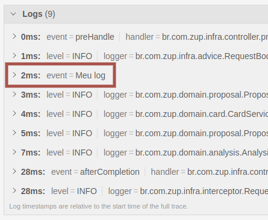

# Jaeger - Log

Sabemos que no OpenTracing existe o conceito de Span, que é um período que representa uma operação, como por exemplo, 
uma requisição HTTP, na qual contém metadados extremamente importantes, como o **log**.

Caso deseje reportar um **log** específico, como por exemplo, email do usuário, precisaremos instrumentar no código!

Vamos fazer isso?

O Spring provê uma classe denominada [Tracer](https://github.com/opentracing/opentracing-java/blob/master/opentracing-api/src/main/java/io/opentracing/Tracer.java) 
na qual você consegue fazer operações relacionadas ao OpenTracing!

1º Precisamos injetar o objeto Tracer, conforme código abaixo:

```java
public class PropostaController {

  private final Tracer tracer;

  public PropostaController(Tracer tracer) {
    this.tracer = tracer;
  }

}
```

2º Agora que temos o objeto, precisamos pegar o `span` ativo, conforme código abaixo:

```java
Span activeSpan = tracer.activeSpan();
```

3º Precisamos definir o **log** desejado, para isso o objetivo Span tem o método `log`, conforme código abaixo:

```java
activeSpan.log("Meu log");
```

Demais né! Vamos testar?

Para testar precisamos verificar se o Jaeger foi iniciado, conforme está no docker-compose, para isto, vamos abrir em 
nosso navegador favorito o endereço `http://localhost:16686/search`

Agora precisamos iniciar nossa aplicação e fazer algumas operações, como por exemplo, criar uma proposta!

Após fazer várias operações, entre no trace da operação que está o código e verifique se o **log** consta, 
conforme imagem abaixo:



Demais né! Agora podemos utilizar vários **logs** para melhorar nosso processo de troubleshooting!

## Dicas de Luram Archanjo

O Spring por padrão já cadastra todos os logs no Jaeger, portanto, não vejo necessidade de instrumentar no código! Porém 
todo conhecimento é válido!

## Informações de suporte

Gostaria de saber mais sobre a Jaeger? [Aqui tem uma explicação do que entendemos que você deve considerar!](https://www.jaegertracing.io/docs/1.18/#about)