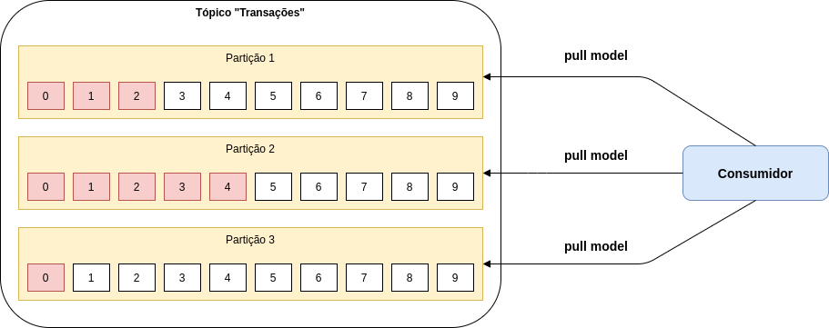
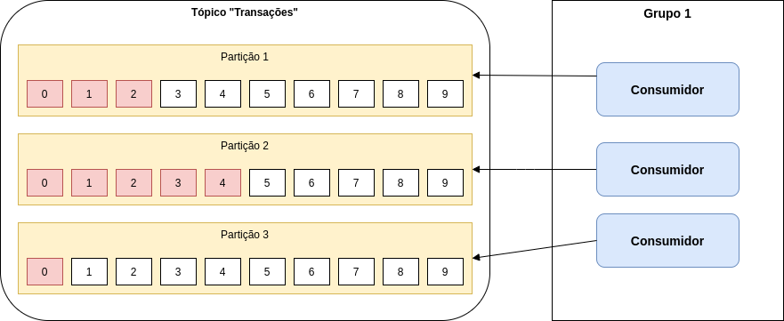

# Kafka - Consumidor

Na arquitetura do Apache Kafka existem vários componentes, como por exemplo, o **Consumidor** que tem a responsabilidade 
de processar os eventos de um determinado tópico.

O consumidor se escreve em um ou mais partições de um determinado tópico e processa os eventos conforme eles vão sendo 
gerados!

A cada processamento o consumidor tem a responsabilidade de gravar em qual ponto ele parou de ler e em qual partição, 
como por exemplo, na imagem abaixo:

Na imagem acima, sabemos que o consumidor consumiu os eventos:

- 0, 1 e 2 da partição 1
- 0, 1, 2, 3 e 4 da partição 2
- 0 da partição 3

Assim caso o consumidor seja parado, por exemplo, para ser atualizado, ele sabe em que ponto ele parou de processar!

Um ponto bastante interessante é que se houver a necessidade de processar novamente os eventos, basta o consumidor zerar 
seu histórico de processamento ([offset](https://kafka.apache.org/documentation/#auto.offset.reset)), pois, o Apache 
Kafka armazena os eventos de cada partição de acordo com o configurado 1 dia, mês, ano, etc.

Para que isso seja possível o consumidor precisa configurar qual modelo ele quer fazer de coletar de eventos:

- latest: Processa a partir do último processado.
- earliest: Zera o offset e processa desde o início.
- none: Não processa nenhum evento e lança uma exceção em sua aplicação.

Demais né! Imagina que seja necessário ter duas instâncias do consumidor, pois, uma única instância não suporta a quantidade 
de eventos!

O problema não será resolvido, pois, a outra instância irá receber os mesmos eventos e consequentemente a mesma carga de 
trabalho!

Pensando nisso o Apache Kafka tem o conceito de `consumer group`, no qual tem a responsabilidade de prover grupos de 
consumidores e balancear a carga de trabalho de acordo com a quantidade de partições!

Parece confuso né!? Não se preocupe, irei te explicar melhor esse comportamento!

Todo consumidor no Apache Kafka deve pertencer a um grupo, e o controle de histórico de processamento é por grupo e 
partição.

O modelo de escalabilidade do consumidor está atrelado a quantidade de consumidor x partições, como por exemplo, imagina que 
meu tópico foi configurado para ter 3 partições e tenho somente um consumidor!

Esse consumidor irá processar o evento de todas as partições, conforme imagem abaixo:

Agora, imagina com dois consumidores do mesmo grupo, ou seja, a carga será balanceada, agora um consumidor irá 
processar de uma partição e o outro das outras duas partições, conforme imagem abaixo:

Demais né! Agora imagina com três consumidores do mesmo grupo, ou seja, a carga será balanceada e será uma partição por
consumidor, conforme imagem abaixo:

Talvez esteja pensando e se tiver quatro consumidores do mesmo grupo? O quarto irá ficar sem atividade, ou seja, ocioso,
conforme imagem abaixo:

Demais né! Agora podemos ter vários grupos que representam vários serviços, como por exemplo, um grupo de análise de fraude, 
extrato, fatura, etc.

## Dicas de Luram Archanjo

Sempre quando utilizamos Apache Kafka temos que pensar em idempotência nos nossos consumidores, pois, pode ser que um dia 
seja utilizado a funcionalidade de processar todos os eventos! Portanto, tenha cuidado com o modelo de commit 
periódico ([Auto commit](https://kafka.apache.org/documentation/#enable.auto.commit)).

Se seu consumidor processou 10 eventos e por algum motivo caiu e não foi executado o commit periódico, ao subir novamente 
seu consumidor irá processar novamente os 10 eventos!

## Informações de suporte

Quer saber mais sobre o Apache Kafka? Acesse o [link!](https://kafka.apache.org)

Quer saber mais sobre os modelos de entrega no Apache Kafka, acesse o [link!](https://kafka.apache.org/documentation/#semantics)

Quer saber mais sobre Consumidor? Acesse o [link!](https://kafka.apache.org/documentation/#theconsumer)