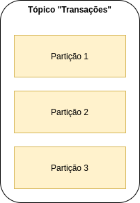
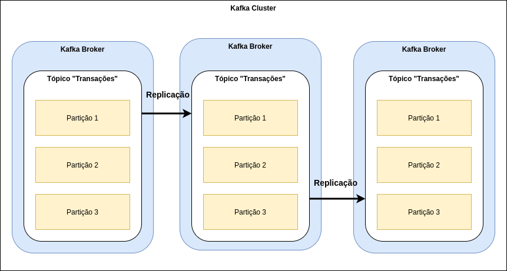

# Kafka - Partição

Na arquitetura do Apache Kafka existem vários componentes, como por exemplo, o Tópico que tem a responsabilidade de 
representar um stream de evento, como por exemplo, um tópico de transações!

O tópico é consistido por várias partições, de acordo com o configurado, como por exemplo, na imagem abaixo:

A partição é uma maneira de prover redundância e escalabilidade, pois, cada partição pode estar em um broker (máquina) 
diferente, conforme imagem abaixo:

Demais né!?

Além dos pontos citados acima temos a possibilidade de segmentar os eventos de acordo com uma determinada chave!

Quando enviamos um evento sem chave, o tópico seleciona aleatoriamente a partição que irá o evento, porém quando enviamos 
com uma chave, todos os eventos com a mesma chave irá somente para aquela partição e de forma **ordenada**, conforme imagem 
abaixo:

Na imagem acima, imagina que temos um sistema de rastreamento de caminhões e gostaríamos de saber **cronologicamente** as 
posições dos mesmos!?

Basta enviar os eventos de posição do GPS com o identificador do caminhão na chave, assim, temos **cronologicamente** todas 
as posições, como por exemplo:

**Caminhão 001**

1. São Paulo ~ 14:00
2. Rio de Janeiro ~ 15:30
3. Espírito Santos ~ 18:00

Imagina se a gente não envia-se o identificador com chave? Ficaria algo aleatório, como por exemplo:

**Caminhão 001**

1. Espírito Santos ~ 18:00
2. São Paulo ~ 14:00
3. Rio de Janeiro ~ 15:30

Para que isso seja possível, a partição trabalha de forma independente, conforme imagem abaixo:

Como a partição trabalha de forma independente, a mensagem que está na posição 0 na partição 1 não é a mesma mensagem 
na posição 0 na partição 2 e assim sucessivamente!

Demais né! Com essa segmentação é possível escalar nossos consumidores e os mesmos pedirem para obter as mensagens da 
posição 4 em diante, por exemplo!

Quer saber mais sobre consumidores? [Aqui tem uma explicação do que entendemos que você deve considerar!!](../informacao_suporte/kafka-consumer.md)

## Dicas de Luram Archanjo

Aproveite ao máximo para aprender sobre esse tema, pois, o mesmo é muito flexível e permite atender vários casos de uso, 
como por exemplo:

- Eventos ordenados
- Eventos não ordenados
- Recuperar eventos retrospectivamente

## Informações de suporte

Quer saber mais sobre o Apache Kafka? Acesse o [link!](https://kafka.apache.org)

Quer saber mais sobre Partição? Acesse o [link!](https://kafka.apache.org/)

Quer saber mais sobre Persistência? Acesse o [link!](https://kafka.apache.org/documentation/#persistence)

Quer saber mais sobre Replicação? Acesse o [link!](https://kafka.apache.org/documentation/#replication)