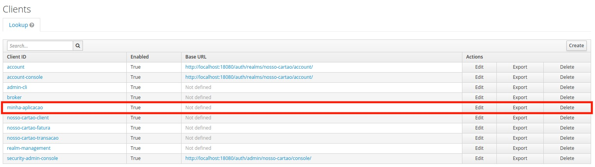

# Criando um cliente no Keycloak

Como já vimos anteriormente o Keycloak é uma ferramenta que permite que possamos gerenciar nossas aplicações (clientes),
desta maneira garantimos essas aplicações, como browser, aplicativos e serviços estejam configuradas e seguras. 

Então é hora de criar nosso primeiro cliente na plataforma, vamos identificar o keycloak na nossa infraestrutura local

Se você usou nosso [docker-compose.yaml](../ops/docker-compose.yaml) você poderá verificar
que temos um elemento chamado **keycloak**. Abaixo segue o fragmento

```yaml
  keycloak:
    image: jboss/keycloak
    ports:
      - 18443:8443
      - 18080:8080
      - 19990:9990
    depends_on:
    ##
    ## restante omitido
    ##
    environment:
    ##
    ## restante omitido
    ##
``` 
A porta de administração padrão do keycloak é **8080**, mas perceba que fizemos um "bind" para
porta **18080**.

Faça o login na plataforma, caso você tenha algum problema em realizar o login [este link pode te ajudar](keycloak-login.md)

Depois disso você deve certificar-se que você esteja no seu Realm previamente criado. Se por algum motivo você não criou seu Realm, sem problemas
[este link vai te ajudar com isso](keycloak-realm.md)

No canto superior esquerdo você pode ver o Realm selecionado, na figura abaixo estamos no Nosso-cartao, no menu **Configure** 
seleciona a opção **Clients** e então clique no botão **Create**. Como na figura abaixo:


Depois você será redirecionado para uma página onde você deverá preencher informações do cliente, como na figura abaixo


Eba! Você criou seu primeiro cliente! Demais né!?

Agora que você criou seu primeiro **cliente**, podemos definir qual será o seu **tipo de concessão**, tais como:

- [Authorization Code](https://oauth.net/2/grant-types/authorization-code/)
- [Client Credentials](https://oauth.net/2/grant-types/client-credentials/)
- [Password Grant](https://oauth.net/2/grant-types/password/)

> Gostaria de saber mais sobre os **tipos de concessões** do **oAuth2**, acesse o [link!](https://oauth.net/2/grant-types/)

Para definir qual será o **tipo de concessão** da sua aplicação, precisamos alterar ela conforme imagem abaixo:



Após abrir a sua aplicação para editá-la, terá três opções de **tipo de concessão**, conforme imagem abaixo:


- Para a **concessão** [Authorization Code](https://oauth.net/2/grant-types/authorization-code/) selecione a opção **Standard Flow Enabled**

- Para a **concessão** [Client Credentials](https://oauth.net/2/grant-types/client-credentials/) ou [Password Grant](https://oauth.net/2/grant-types/password/) selecione a opção **Direct Access Grants Enabled**

- Para a **concessão** [Client Credentials](https://oauth.net/2/grant-types/client-credentials/) selecione a opção 
**Access Type** como **confidential** e a opção **Service Accounts Enabled**

Eba! Você criou seu primeiro **cliente** e configurou o **tipo de concessão**!