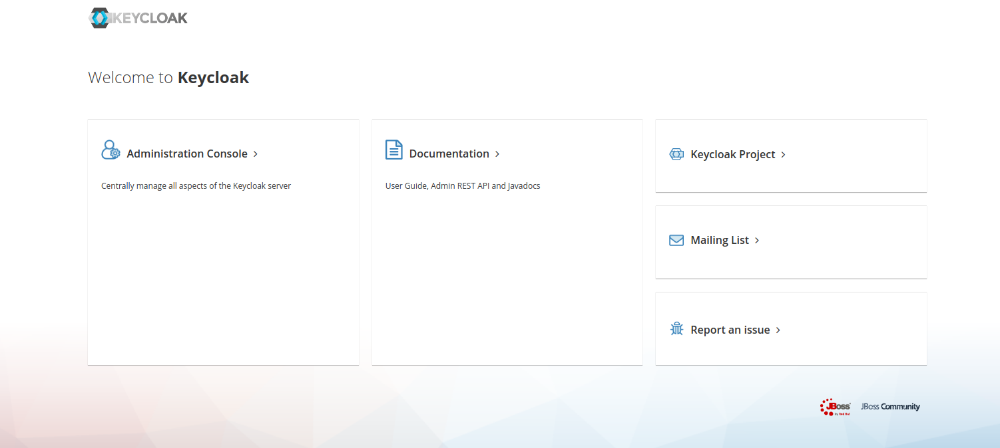
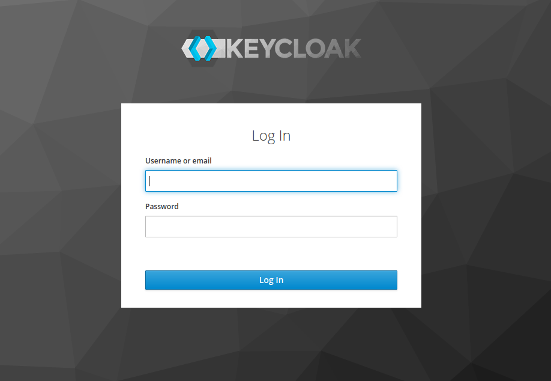

# Logando no Keycloak

Ok. Conhecemos um pouco do conceito de IAM.

Agora é hora de logarmos na plataforma.

Se você usou nosso [docker-compose.yaml](../ops/docker-compose.yaml) você poderá verificar
que temos um elemento chamado **keycloak**. Abaixo segue o fragmento

```yaml
  keycloak:
    image: jboss/keycloak
    ports:
      - 18443:8443
      - 18080:8080
      - 19990:9990
    depends_on:
    ##
    ## restante omitido
    ##
    environment:
    ##
    ## restante omitido
    ##
``` 
A porta de administração padrão do keycloak é **8080**, mas perceba que fizemos um "bind" para
porta **18080**.

Então vamos lá. Vá para o [keycloak](http://localhost:18080)

Deve ser apresentada a seguinte tela.



Clique no link [Administration Console](http://localhost:18080/auth/admin/) Logo a seguinte tela deve ser apresentada...



Quase lá!!! Então você deve fornecer as credenciais de administração e pronto!!!

Você deve ver a seguinte página...
 


Pronto!!! Você conseguiu realizar sua primeira iteração com Keycloak.. Parabéns...

## Informações de suporte

* Talvez você pode estar se perguntando, qual a função sobre o docker-compose. [Aqui você pode encontrar](https://docs.docker.com/compose/)